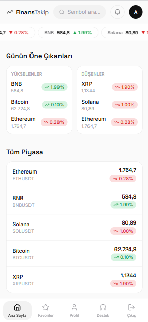
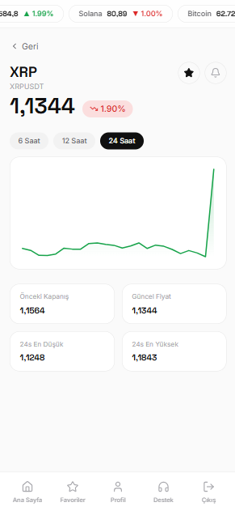

# 📈 FinansTakip

Gerçek zamanlı kripto para takip uygulaması. Binance WebSocket üzerinden alınan anlık piyasa verilerini **ASP.NET Core SignalR** ile frontend'e aktaran, **Google OAuth 2.0** ile kimlik doğrulama sağlayan modern bir **Full Stack** projedir.

---

## ✨ Özellikler

- 🔴 Gerçek zamanlı kripto para fiyat takibi
- ⚡ Binance WebSocket üzerinden canlı veri akışı
- 📡 SignalR ile anlık veri güncellemesi
- 🔐 Google OAuth 2.0 ile güvenli giriş
- ⭐ Favoriler (Watchlist) yönetimi
- 🔔 Fiyat alarm sistemi
- 📊 Detaylı grafik ve fiyat geçmişi
- 📱 Responsive kullanıcı arayüzü

---

# 🛠️ Teknoloji Yığını

## Frontend

- React 18
- TypeScript
- Vite
- Tailwind CSS
- SignalR Client
- Axios
- React Router

## Backend

- ASP.NET Core (.NET 8)
- SignalR
- Entity Framework Core
- SQLite
- Clean Architecture
- Binance REST API
- Binance WebSocket API
- Google OAuth 2.0

---

# 🏗️ Proje Mimarisi

Proje **Clean Architecture** prensiplerine göre geliştirilmiştir.

```
backend/
│
├── FinansTakip.API
│   ├── Controllers
│   ├── Hubs
│   └── Program.cs
│
├── FinansTakip.Application
│   ├── DTOs
│   ├── Interfaces
│   └── Services
│
├── FinansTakip.Domain
│   └── Entities
│
├── FinansTakip.Infrastructure
    ├── Binance
    ├── Data
    ├── Repositories
    └── BackgroundServices
```

Bu yapı sayesinde;

- İş mantığı altyapıdan bağımsızdır.
- Test edilebilirlik yüksektir.
- Yeni özellik eklemek kolaydır.
- Kod okunabilirliği ve sürdürülebilirliği artar.

---

# ⚙️ Gerçek Zamanlı Veri Akışı

```
Binance WebSocket
        │
        ▼
BackgroundService
        │
        ▼
SignalR Hub
        │
        ▼
React Frontend
        │
        ▼
Canlı Güncellenen Arayüz
```

### Çalışma Mantığı

1. Backend içerisinde çalışan **BackgroundService**, Binance WebSocket yayınına bağlanır.
2. Gelen fiyat değişimleri işlenir.
3. Veriler SignalR Hub üzerinden tüm istemcilere gönderilir.
4. React uygulaması SignalR bağlantısını dinler.
5. Kullanıcı arayüzü sayfa yenilenmeden anlık olarak güncellenir.

---

# 🚀 Kurulum

## Gereksinimler

- Node.js 18+
- NET SDK 8.0+
- Google OAuth Client ID

---

## Backend

```bash
cd backend/FinansTakip.API

dotnet restore

dotnet run
```

Backend varsayılan olarak aşağıdaki adreste çalışır.

```
https://localhost:7065
```

---

## Frontend

```bash
cd frontend

npm install
```

`.env` dosyası oluşturun.

```env
VITE_API_BASE_URL=https://localhost:7065
VITE_GOOGLE_CLIENT_ID=YOUR_GOOGLE_CLIENT_ID
```

Ardından projeyi çalıştırın.

```bash
npm run dev
```

Frontend aşağıdaki adreste açılır.

```
http://localhost:5173
```

---

# 📸 Ekran Görüntüleri

> Buraya uygulamadan ekran görüntüleri ekleyebilirsiniz.

```markdown



```

---

# 🔗 Canlı Demo
```
https://your-demo-link.com
```

---

# 📌 Gelecek Özellikler

- [ ] Email bildirimleri
- [ ] Push Notification
- [ ] Daha fazla teknik analiz grafiği
- [ ] Çoklu borsa desteği
- [ ] Portföy yönetimi
- [ ] Fiyat geçmişi raporları

---

# 📝 Notlar

- Bu proje eğitim ve portföy amacıyla geliştirilmiştir.
- Yatırım tavsiyesi niteliği taşımaz.
- Backend'e erişilemediğinde frontend otomatik olarak **Demo Mode** ile çalışmaya devam eder.

---